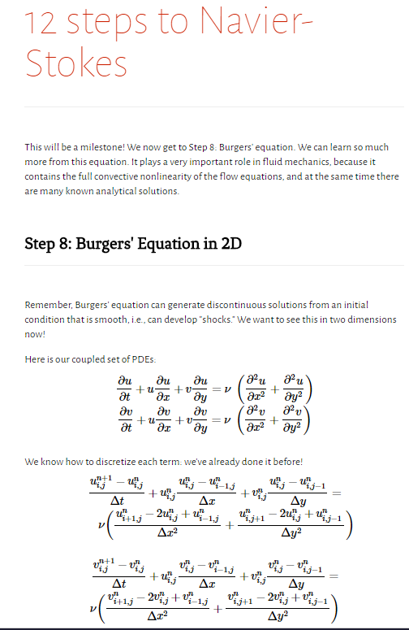
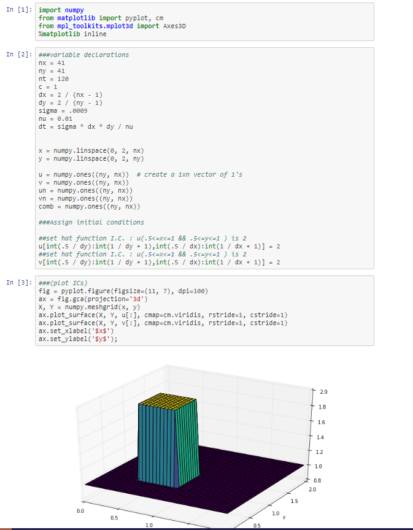
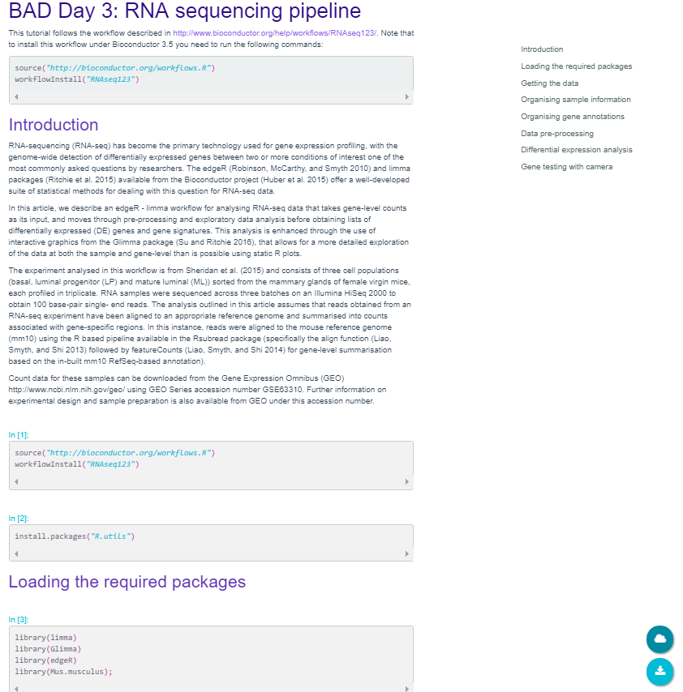
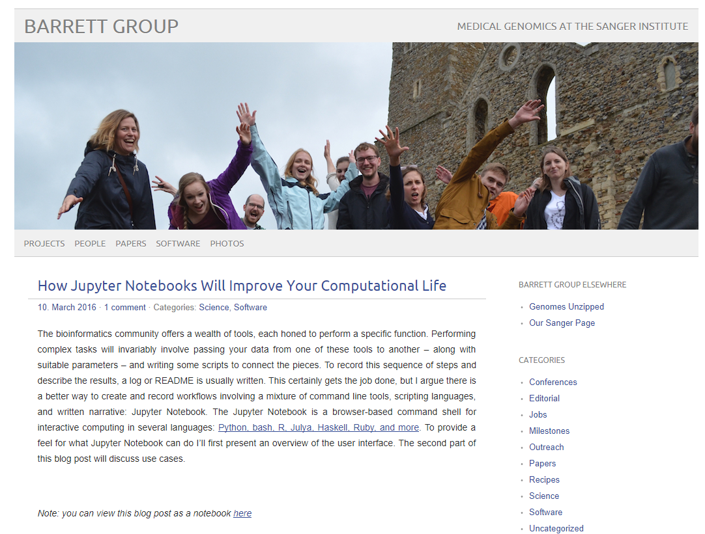
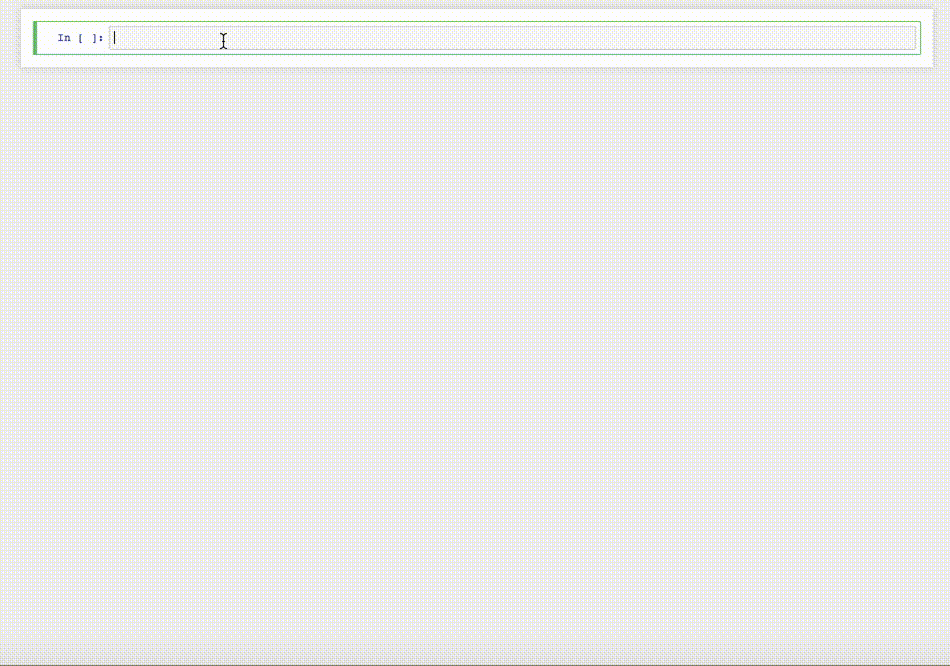

### <i class="fa fa-exclamation-triangle" aria-hidden="true"></i>  We know you are eager to start but first things first
We need to make sure evrything is up to date

- We created this Etherpad for the workshop: [https://etherpad.wikimedia.org/p/RSE-reproNB](https://etherpad.wikimedia.org/p/RSE-reproNB)

- Follow the instructions given in the learner's instructions file: [https://goo.gl/DB6XEb](https://goo.gl/DB6XEb)

## Why do we care so much about software sustainability?

* Will my code still be used in 5-10 years? <!-- .element: class="fragment" -->
* Can my software be found? <!-- .element: class="fragment" -->
* How easily can others use/maintain my software? <!-- .element: class="fragment" -->
* How does my software impact <!-- .element: class="fragment" --> <accent-text> research</accent-text> ?

## We are <strong> Research</strong> software engineers
In research, experiments/results are not trusted unless:
- The experimental setup is <strong>tested</strong>
- The method is <strong> well-documented </strong>
- We can demonstrate that our results are <strong> reproducible  and reliable</strong>

## <display-text>So why would scientific software be any different?</display-text>
It should follow sustainable practices (e.g. version control, testing, continuous integration, code coverage)

and we should not trust results obtained from
codes without proper testing and/or documentation<!-- .element: class="fragment" -->

## Are we changing research?
More and more research groups are concerned about reproducibility
in computational areas/science.

<i class="fa fa-arrow-circle-down" aria-hidden="true"></i>

Leading to better standards for research specific software as a fundamental part of
scientific advancement<!-- .element: class="fragment" -->

## Jupyter notebooks are taking over
<ul>
<li class='fragment'> Versatile tool: with <strong> over 80 kernels </strong>available</li>
</ul>

  
 Essentially over 80 programming languages available 

<ul class='fragment'>
<li> Publication ready documents </li>
<ul>
  <li> Script for data analysis/modelling <l/i>
  <li> Text and mathematical equations</li>
  <li> Plots and other digital objects generated</li>
  <li> Dynamic interactions (ipywidgets)</li>
</ul>
</ul>

 
<accent-text> Let's have a look at some examples...</accent-text>

### Lorena Barba's famous notebooks

[12 Steps to Navier Stokes](http://lorenabarba.com/blog/cfd-python-12-steps-to-navier-stokes/)

### Bioinformatics awareness days at Sheffield

 [See here](http://bitsandchips.me/BAD_days)

### Everybody loves the notebooks!!

#### And develop resources on top of them

[ipyaladin](https://github.com/cds-astro/ipyaladin)
