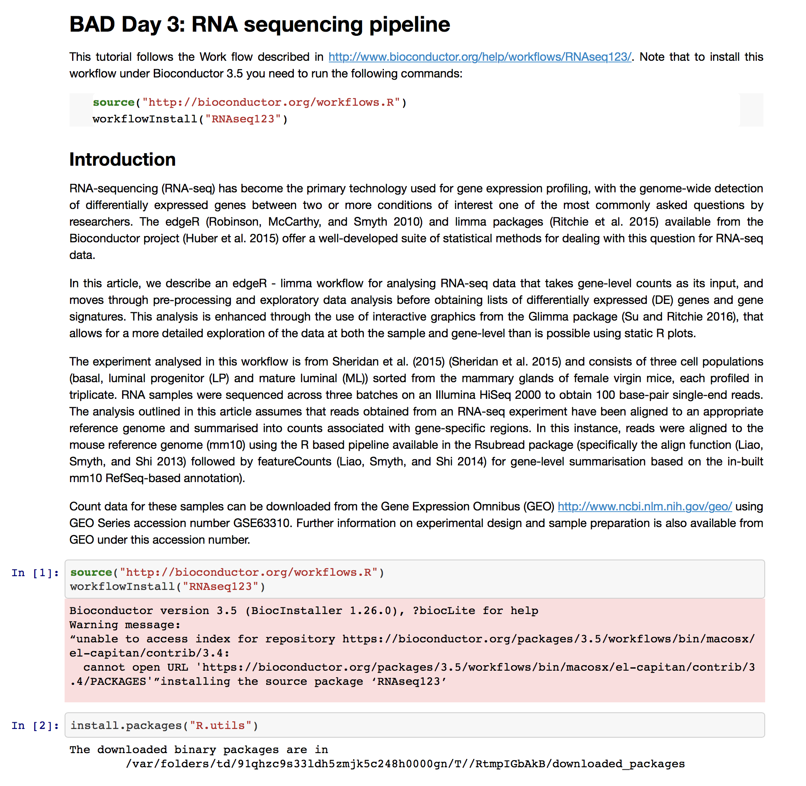
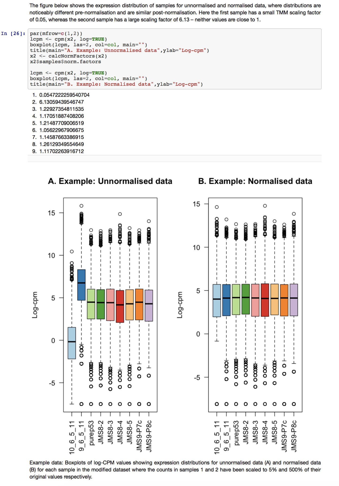
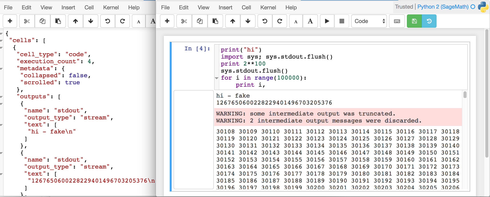

<section class='dark-diagonal'>

<h1> Notebooks and version control systems - natural bedfellows?</h1>

</section>

## I love Jupyter notebooks and Version control!

 <i class="fa fa-github"></i> Let's play a game... 

We have this Jupyter notebook in our workshop repo...

<small> The original can be found at [https://goo.gl/tbfNpi](https://goo.gl/tbfNpi) </small>

We already have a Jupyter server running in our container so let's use this to have a look at the notebook we will be using:
`RNA-sequencing.ipynb`

One of our collaborators has made some changes...
- Can you tell what those changes are?
- How readable are these changes?

---

Head to [https://goo.gl/4RUcB7](https://goo.gl/4RUcB7)
---

<i class="fa fa-clock-o" aria-hidden="true"></i> You have 5 minutes

Write your findings in our etherpad:
 
[https://goo.gl/JsmJQS](https://goo.gl/JsmJQS)

<section class='two-colors'>

<h2><display-text> That did not go very well </display-text></h2>

  

  <h3 class='dark'> <i class="fa fa-github" aria-hidden="true"></i></h3>
   
  Jupyter notebooks are saved in the form of plain text JSON format...

 

  

    
  

  

  

  But our traditional  line-based diff and merge tools fail to 'understand' their structure.
   
  So we end with something like this...
  

  

  
</section>

<section data-background-image="resources/diff_example.png">
<h1><accent-text> Not human readable!</accent-text></h1><!-- .element: class="fragment" -->
</section>
