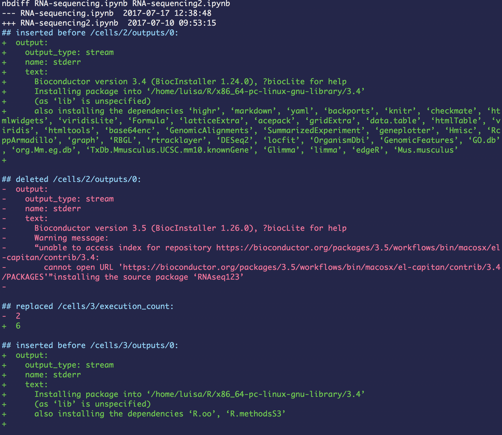
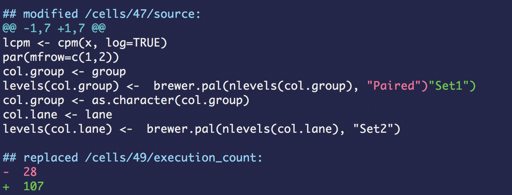
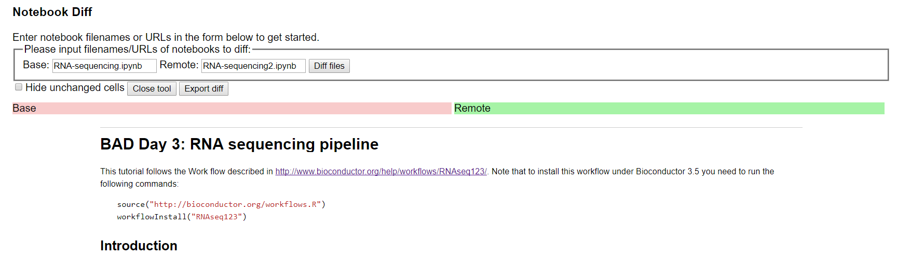
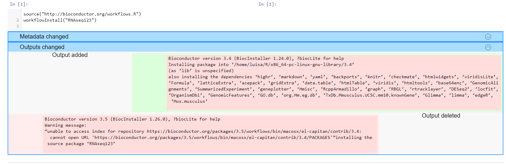
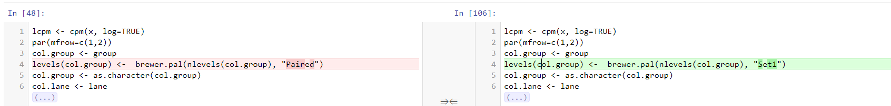
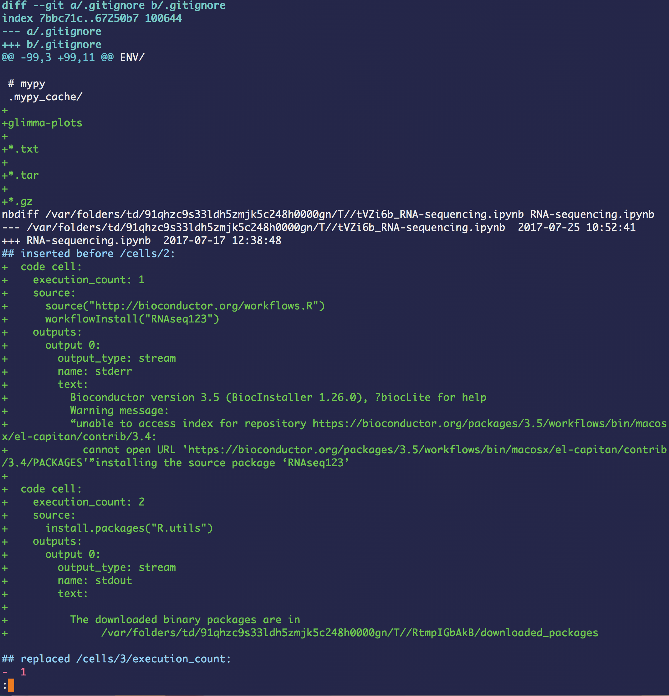
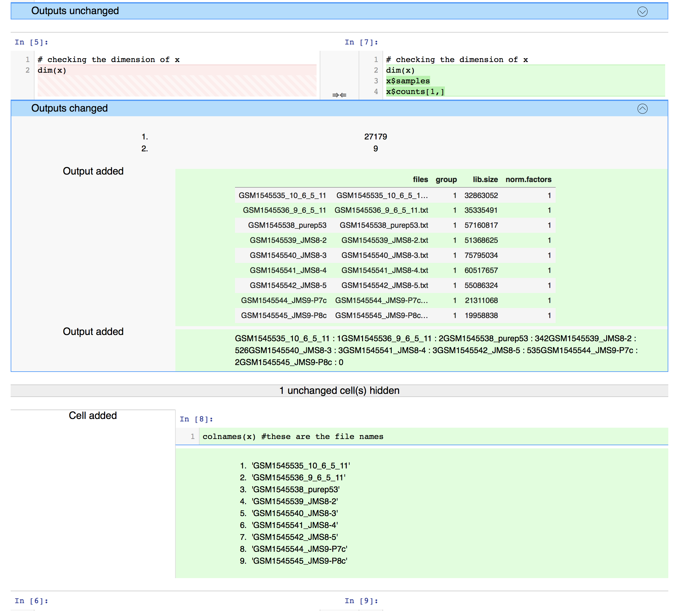

<section class='dark-diagonal'>

<h1> Fear not! <accent-text> nbdime</accent-text> can help</h1>

<h3> nbdime: Notebooks diffing and merging tool </h3>
<a href='http://opendreamkit.org'>
</a>
<br>
 Click here for the [Nbdime documentation](https://nbdime.readthedocs.io/en/latest/#)
</section>


## Getting nbdime
Normally you'd add it via pip :
```
$ pip install nbdime
```
( <strong> we've done this for you already </strong>)

You get:
- Command line diffing and merging tools
- Web client based tools (offline use)
- Integration with git


## Now let's play with this
<i class="fa fa-code-fork" aria-hidden="true"></i> First fork this repo:

<p class= "fragment grow"> [https://github.com/trallard/JNB_reproducible](https://github.com/trallard/JNB_reproducible)
</p>

---
Now let's do a clone <i class="fa fa-clone" aria-hidden="true"></i>:
```
$ git clone <your fork>
```
And make sure you are on the <accent-text>master</accent-text> branch.


## Getting started
The most basic example...
Diffing two notebooks:
```bash
$ nbdiff -so diff_ex/RNA-sequencing.ipynb diff_ex/RNA-sequencing2.ipynb
```
You can specify the parts to be compared:
- `--sources` / `-s`
- `--outputs`/ `-o`
- `--metadata` / `-m`
- `--attachments` / `-a`


## Much better






## Diffing on the web-app
Like in the previous example, we can compare the two notebooks...
and display <strong> rich rendered diff </strong> diffs on our web browser.

```bash
$ nbdiff-web -so diff_ex/RNA-sequencing.ipynb diff_ex/RNA-sequencing2.ipynb
```









## Are you forgetting about version control?

<br>
<small> Taken from http://geek-and-poke.com/ </smal>


## NBDIME version control integration
(Note: only git is supported at the moment)
- As <strong> drivers </strong> for your diff and merge operations (nbdime takes over these)
- Defining nbdime as diff and merge <strong> tools </tools>


## Integrate with git
Configuring all diff/merge drivers and tools:
```
nbdime config-git (--enable | --disable)[--global | --system]
```

- for the current repository
- for this user (global)
- at system level


### Diffing two commits on the command line
```bash
$ git diff de2863c 404e4e0
```



## Using your web browser
```
$ nbdiff-web de2863c 404e4e0
```



