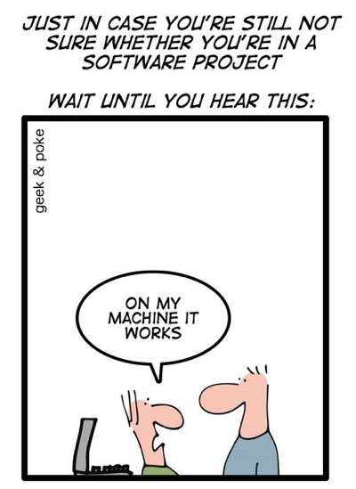
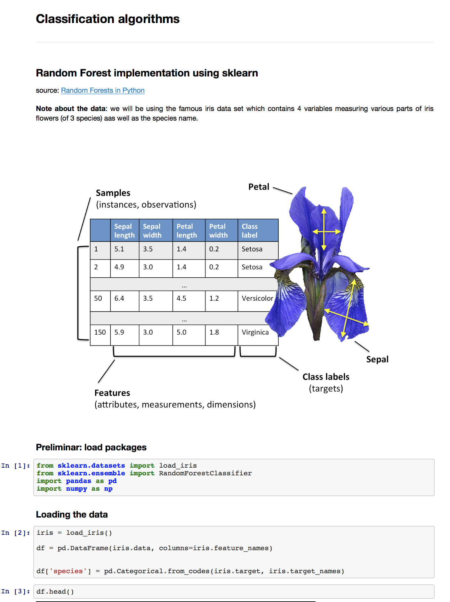
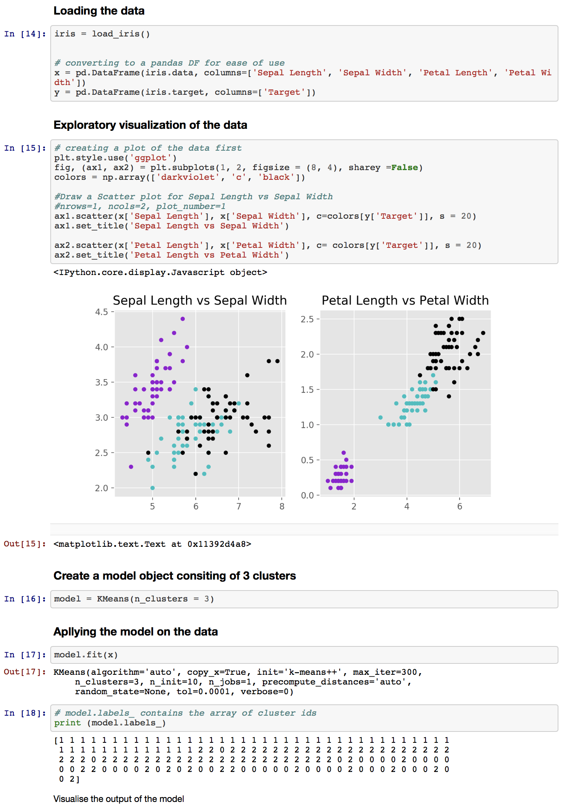
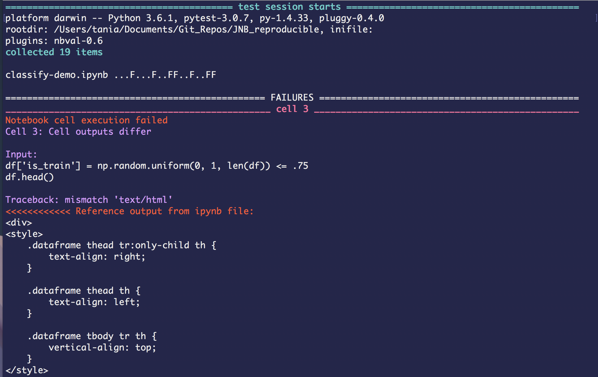
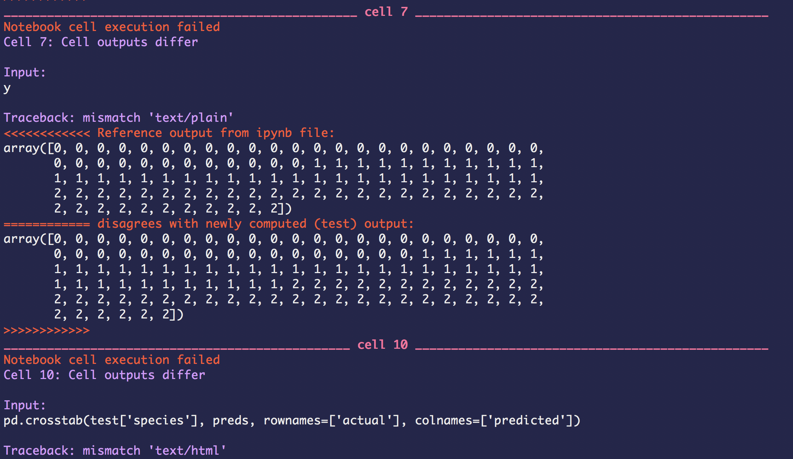
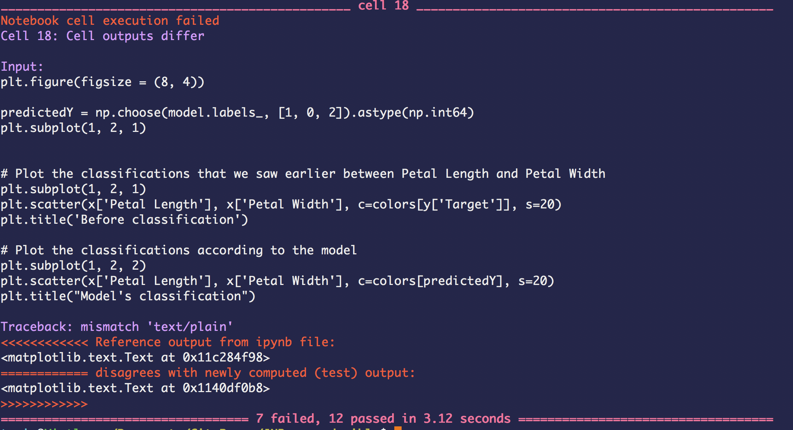
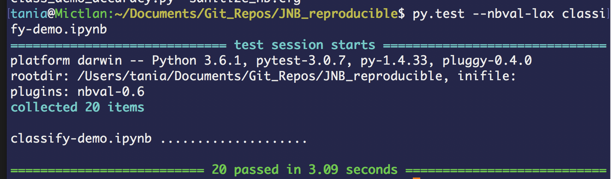

<section class='dark-diagonal'>

<h2>Notebook <accent-text> testing</accent-text> with nbval</h2>

<br>
<small> Taken from http://geek-and-poke.com/ </small>
<br>
</section>


### Brought to you by... OpenDreamKit too!
#### (these guys are doing good stuff!)

<br>
<a href='https://github.com/computationalmodelling/nbval'><i class="fa fa-github" aria-hidden="true"></i> repo here </a>


## Getting nbval
(Again we did this for you)
```
$ pip install nbval
```

---
<h2 class= "fragment fade-up"> Just some info... </h2>
- It is a py.test plugin which enables it to recognise and collect Jupyter notebooks <!-- .element: class="fragment" -->
- Checks inputs and outputs <!-- .element: class="fragment" -->
- Ensures that the notebooks are running without errors <!-- .element: class="fragment" -->


## Hands-on
We will be working with this Jupyter notebook:





You can find it here: [https://goo.gl/B2Y4J7](https://goo.gl/B2Y4J7)


## Validating the notebook
You need to execute `py.test` using the `nbval` flag to differentiate the testing:

```
$ py.test --nbval classify-demo.ipynb
```


### The output






<section class='two-colors'>

<h2><display-text> How does this work?</display-text></h2>
<div class='items-block'>
  <div class="single-block single1">
  <ul>
  <li> Manual run of the notebook </li> <!-- .element: class="fragment" -->
  <li> Outputs and inputs are <strong> stored </strong> in the notebooks </li> <!-- .element: class="fragment" -->
  <li> These outputs will be used a <strong>reference</strong> for the tests</li> <!-- .element: class="fragment" -->
  </ul>
  </div>

  <div class="single-block single2">
  <ul>
  <li> Validating with py.test runs the notebook <strong>without
  storing </strong> the information</li> <!-- .element: class="fragment" -->
  <li>Compares the new outputs to the <strong> stored ones </strong></li> <!-- .element: class="fragment" -->
  </div>
  </div>
</section>


<h3><accent-text> <i class="fa fa-meh-o" aria-hidden="true"></i>
 At the moment our test is failing... </accent-text><h3>




# <i class="fa fa-comments-o" aria-hidden="true"></i> Why?

Write your ideas on the etherpad:
<br>
[https://goo.gl/JsmJQS](https://goo.gl/JsmJQS)

---
<ul>
<element class="fragment">
<li> Random outputs will always fail </li>
<pre><code class='python'>[np.random.rand() for i in range(4)]
</pre></code>
</element>
<element class='fragment'>
<li> Time and date change on every run </li>
</element>
</ul>


# <i class="fa fa-comments-o" aria-hidden="true"></i> Discuss
- How would you avoid the issues faced before?
- What approaches do <strong> you </strong> normally use to avoid/resolve these or similar issues?

---
<p class= "fragment fade-left">
Write your suggestions in the etherpad:
<br>
[https://goo.gl/JsmJQS](https://goo.gl/JsmJQS)
</p>


## <i class="fa fa-bolt" aria-hidden="true"></i> Some fixes...
You can provide a sanitizing file at the command prompt e.g.:
```
$ py.test --nbval classify-demo.ipynb --sanitize-with sanitize_nb.cfg
```
In fact you have one in your repository: `sanitize.cfg`
```bash
[regex1]
regex: \d{1,2}/\d{1,2}/\d{2,4}
replace: DATE-STAMP

[regex2]
regex: \d{2}:\d{2}:\d{2}
replace: TIME-STAMP
```


Explicitly say which outputs to evaluate
You need to open the Jupyter notebook and select which cells to be evaluated or not.
```python
# NBVAL_IGNORE_OUTPUT
# NBVAL_CHECK_OUTPUT
```


If you are only interested in verifying if your notebooks <strong>are broken or not</strong>
you can specify `--nbval-lax` which runs notebooks and checks for errors, but only compares the outputs of cells with a `#NBVAL_CHECK_OUTPUT` marker comment.
```bash
$ py.test --nbval-lax classify-demo.ipynb
```



