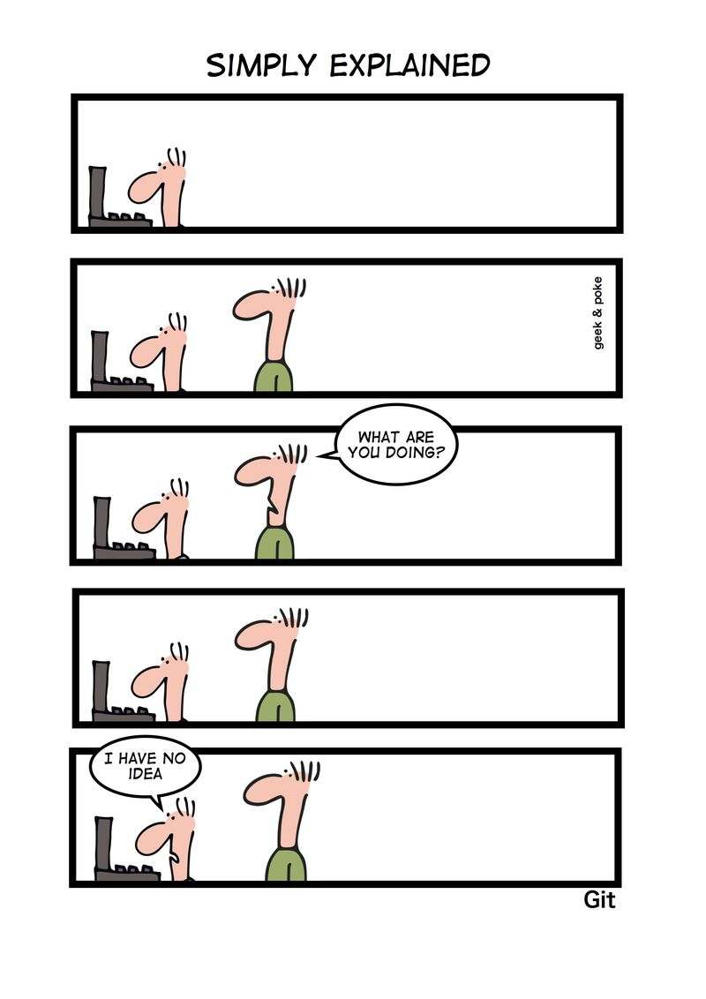
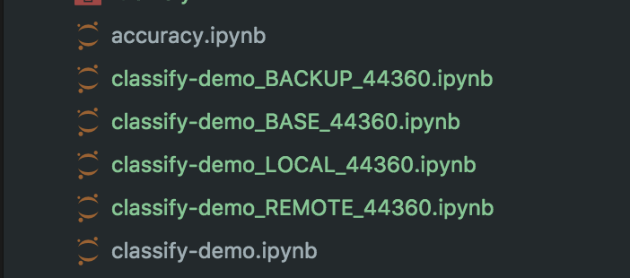

<section class='dark-diagonal'>

<h2>More hands on... yei!</h2>

<br>
<small> Taken from http://geek-and-poke.com/ </small>
<br>
<div class='float_modal fragment fade-in'>
  <p class='modal_p'> This is entirely optional... so feel free
  to go along at your own pace </p>
</div>
</section>


## First things first...
Are you still on the <accent-text> master</accent-text> branch?

If so you should have the following notebooks:
- classify-demo.ipynb
- PCA.ipynb

We are going to merge them using a python script you've been given:
```bash
$ python scripts/nbmerge.py classify-demo.ipynb PCA.ipynb > full_classify.ipynb
```


## Did this work?
```
$ nbshow full_classify.ipynb
```

## Did I break the notebooks?
```
$ py.test --nbval-lax full_classify.ipynb
```


## Switch to the <accent-text>hands-on</accent-text> branch
Repeat the nb merge:
- classify-demo.ipynb
- accuracy.ipynb

```
$ python scripts/nbmerge.py classify-demo.ipynb accuracy.ipynb > full_classify.ipynb
```
Making sure this works
```
$ py.test --nbval-lax full_classify.ipynb
```


## And here comes the fun
Now we have made changes in both branches...shall we try and merge both branches?
```
$ git checkout master
$ git merge hands-on
```

aaaaand we end up with something like this! <!-- .element: class="fragment" -->
 <!-- .element: class="fragment" -->


## Once again nbdime should help us here

```
$ nbmerge base.ipynb local.ipynb remote.ipyn > merged.ipynb
```

```
$ nbmerge-web base.ipynb local.ipynb remote.ipyn -o merged.ipynb
```


### Finally... how can you make sure that your notebooks are not broken??
 Well without having to manually do it<!-- .element: class="fragment" -->

 <accent-text> Continuous integration!</accent-text> <!-- .element: class="fragment" -->

---

You can check the status of this repo here: <!-- .element: class="fragment" -->

[https://travis-ci.org/trallard/JNB_reproducible](https://travis-ci.org/trallard/JNB_reproducible) <!-- .element: class="fragment" -->


## Very basic CI use
You should have a `.travis.yml` file. This tells Travis what steps to follow for your build plus some other nice stuff:

- language
- install
- before_script
- <strong> script </strong>
- after_script
- after_sucess
- branches


<display-text> And this is only the very beginning... </display-text>
<display-text> Thank you all :)  </display-text>
